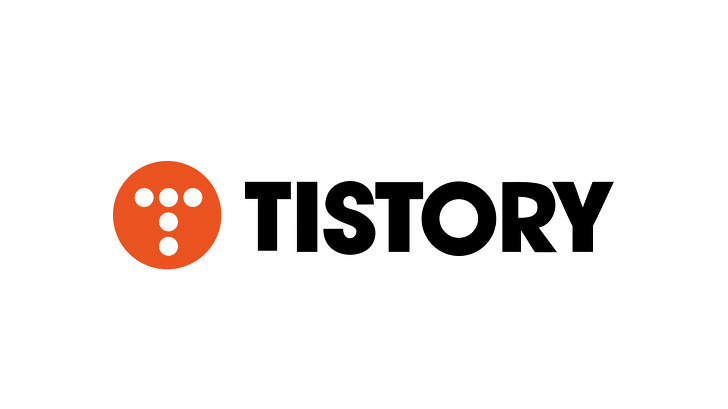
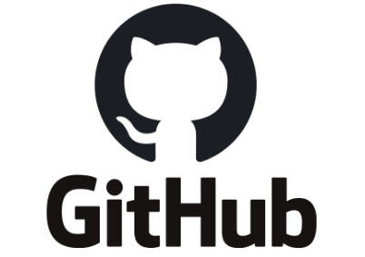

# 내가 블로그를 새롭게 시작하는 이유

처음 블로그를 시작했을 무렵, 평소에 나는 공부한 내용들을 단순히 기록하는 용도로만 사용했었다.

기술 블로그 플랫폼으로는 수많은 플랫폼 중에서 [티스토리](https://www.tistory.com/)라는 플랫폼을 통해 블로그를 관리해왔다.

    

<!-- {height=400px width=500px} -->

## 그런데 왜 이 티스토리 블로그를 놔두고 갑자기 새롭게 기술 블로그를 시작해야 했는가..?

이 부분에 대해서 의아해 할 수 있다.

그 이유는 바로 <strong>`내가 성장하고 있다는 스스로의 착각`</strong> 에서 벗어나고 싶어서이다.

### 착각...? 갑자기...?

### 이게 과연 무슨 말인가..?

왜 내가 그런 착각을 한다고 생각을 했냐 하면, 개발 공부를 하고 나면 블로그에 글을 게시하는데 게시된 글을 보면 대부분 내 생각은 거의 반영되지 않고 오로지 공부한 내용만 적혀진 게시글들이 대부분이었다.

뭐 매번 그런 건 아니지만, 거의 대부분이 그랬다.

그래서 나는 어느 순간부터 기술 블로그를 정말 말 그대로 공부하고 기록하는 용도로만 사용하고 있었다.
 

    

 
### 그렇다.

나는 단순히 공부한 내용만 기록하는 기술 블로그를 운영하고 있었고, 게시글들이 점차 많아지면서 나는 무언가 많은 공부를 하고 있다고 내 스스로가 착각하고 있었다.

이건 마치 <strong>`나 자신에게 오늘 공부했으니까 너는 정말 잘하고 있어!`</strong>라고 안심을 시켜주는 것 같았다.

그렇게 점점 게시글들은 점점 많아지는 있었고, 실제로 내가 올린 게시글 중에 정확히 안다고 말할 수 있는 게 과연 몇이나 될까..?라는 의문을 가지게 되었다.

그 결과는 정말 잔인하게도 나는 단연코 정확히 안다고 말할 수가 없었다.

안타깝지만 나는 정말로 많은 변화가 필요했다.

이게 바로 <strong>`내가 기술 블로그를 다시 시작하는 가장 큰 이유`</strong>이다.

이제부터 나는 기술 블로그를 작성할 때, 단순히 기록하는 글이 아니라 공부해서 정리한 내용을 어느 정도 이해했다는 가정하에 남에게 설명하듯이 작성하도록 최대한 노력할 것이다.

그러기 위해 다시 시작하는 것이니까!

 
 
 

# 그렇다면 새 기술 블로그는 왜 GitHub 블로그?

 

    

<!--  -->

 
사실 블로그를 쓸 수 있는 플랫폼들이 굉장히 많이 있었다.

앞서 말한 티스토리를 제외하면

- 네이버 블로그 Naver
- 벨로그 velog
- 브런치 brunch
- 워드프레스 wordpress
- 미디엄 Medium
- 깃허브 블로그 github.io
- 노션 Notion

나는 그 중에서 <strong>`GitHub 블로그`</strong>를 선택했다.

내가 깃허브 블로그를 선택한 이유 중 하나는 바로!

- 다른 블로그 플랫폼 자체에서 제공하는 테마들이 맘에 들지 않았던 점과
- 그리고 또 하나는 프론트엔드 개발자이기 때문에 나만의 블로그를 한번 만들어 보고 싶었다는 점 때문에 그랬던 것 같다.

<strong>`GitHub 블로그`</strong>도 여러 테마들이 존재했었는데, 그중 맘에 드는 테마는 골라서 사용하고 있다.

하지만 점차 테마는 내 입맛대로 커스텀이 될 것 같다.

또 쓰면서 느낀 점은 글 올리는 데 정말 손이 많이 가고 초기 세팅 때문에 진입 장벽이 높다는 느낌이 들었다.

이게 부담이라면 다른 블로그 플랫폼을 사용하는 것을 추천한다.
 
 
 

# 너 자신을 알라..

 

    

 

## 나는 누구인가..?

뜬금없지만 가끔 누군가가 나에 대해 묻는다면 나는 대답을 잘 못했다.

너무 바쁘게 살았던 것일까 이제까지 나는 내가 어떤 사람인지 나에 대해 생각해 본 적이 없다.

왜냐하면 나에 대해서 알아가려는 시도를 하지 않았던 것 같다.

그래서 요즘엔 사람들을 많이 만나서 나에 대해 물어보는 편이다.

뭐 예를 들어 말을 차분하게 잘하고, 잘 챙겨주고, 근데 좀 답답한 것도 있다는 등등의 답변을 들으며, 서서히 나에 대해 알아가고 있는 중이다.

 

## 나는 왜 개발을 시작하게 되었는가?

 

    

 

나는 어렸을 때 노래 부르는 것을 굉장히 좋아했었다.

그 때문에 학창 시절 실용음악과 진학을 목표로 열심히 입시 준비도 했었다.

하지만 너무 열심히 했던 탓일까 목을 한번 크게 다쳤었다.

그렇게 3년 동안 준비한 입시도 망하고 다시 돌아오겠지 마음으로 1년을 더 부여잡고 준비했지만,

좀처럼 목 상태가 다시 돌아오지 않았다.

그렇게 나는 모든 걸 내려놓은 상태로 군대를 가게 되었다.

군대에서 음악 말고 뭘하면 좋을까 라는 생각을 정말 많이 했다.

어느날 갑자기 중국어를 공부하기도 하고, 또 어느 날은 기술 배우겠다고 자격증을 공부하기도 했었다.

그러다 결국 전역 후에 나는 대학을 가서 공부해야겠다는 결론을 내렸다.

학창 시절 나는 예체능 준비로 인해 학업에 신경을 잘 못썼다.

하지만 그래도 나름 내신 관리를 열심히 했기에, 다행히도 수시로 성적에 맞춰서 대학에 입학할 수 있게 되었다.

그중에서 나는 취업이 잘 된다는 이유로 컴퓨터공학과에 입학을 하게 되었다.

정말 단순하지만 내가 <strong>`개발을 시작하게 된 이유`</strong>이기도 하다.

다녀보니 다행히도 그렇게 막 적성에 안 맞지도 않았다.

 

## 그렇게 프론트엔드 개발자가 되다!

그렇게 학교에서 공부를 하고 졸업을 하게 되었다.

졸업 후 바로 취업은 했지만, 내가 원하던 일을 하는 것이 아니기에 수습 기간에 일찍 퇴사했다.

나는 너무 학교 공부만 했던 탓이었을까, 퇴사 후 내 진로에 대해 진지하게 생각 해보게 되었다.

나는 분명 it 직종으로 일하고 싶은데 어떤 분야로 가야 하는 것인가?

매일 나에게 되물었다.

나는 평소에 웹 쪽에 관심이 많았고, 그중 html, css에 관심이 있었다.

어떤 쪽으로 나가야 할지 고민하다가 우연히 프론트엔드라는 개발에 대해서 알게 되었다.

그 분야에 대해서 더 알아보고 이 분야로 취업을 해야겠다고 다짐하며, 바로 부트 캠프에 프론트엔드 개발 과정을 등록하게 되었다.

대신 가격이 정말 비쌌다... 후덜덜...

나는 그곳에서 총 3개월 중에 2달은 html, css, javascript, react 등 학교에서 익히지 못했던 것에 대해 공부하였고 한 달 동안 기업에서 인턴 생활도 하게 되었다.

정말 열심히 했기에, 실력 또한 많이 늘기도 했다.

그래서 나는 수료하면 바로 취업할 줄 알았다.

하지만 현실은 그렇지 않았다.

내가 열심히 한 것만큼 다른 사람들도 열심히 했기에 경쟁이 너무나도 치열했다.

이력서, 과제, 코딩 테스트 너무나도 하루하루가 힘들었다..

그렇게 준비를 계속하다가 운이 좋게도 부트 캠프에서 같이 프로젝트를 했던 분에게 6개월 인턴 제의가 들어오게 되었다.

완전 초기 스타트업이어서 걱정이 많이 됐지만, 개발자로서 많이 성장할 수 있을 것 같아 결국 인턴을 하게 되었다.

그렇게 나는 <strong>`프론트엔드 개발자`</strong>가 되었다고 한다..

 

## 끝으로..

사실 나는 지금도 개발자라는 직업에 대해 자부심도 가지는 반면, 부담감을 항상 지닌다.

세상은 빠르게 변하고 있고 그에 맞게 기술도 빠르게 변하고 있다.

우리는 그 변화에 맞게 계속 공부하고 새로운 변화를 받아들여야 한다.

하지만 사실 이게 결코 쉬운 일은 아니다.

나는 이 쉽지 않을 일을 내가 하고 있기에 자부심을 느낀다.

그 때문인가 나는 현재 새로운 것을 익히는 것이 어렵기도 하지만 분명 재밌다.

향후 나에게 어떤 고난과 역경이 찾아올지는 모르지만, 물론 개발일 수도 있고,

그게 무엇이 던 간에 그 순간을 만족하며 즐기고 싶다.

    

 
