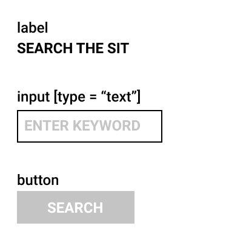
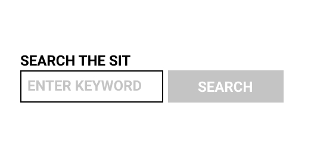
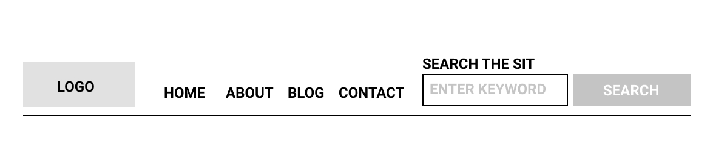
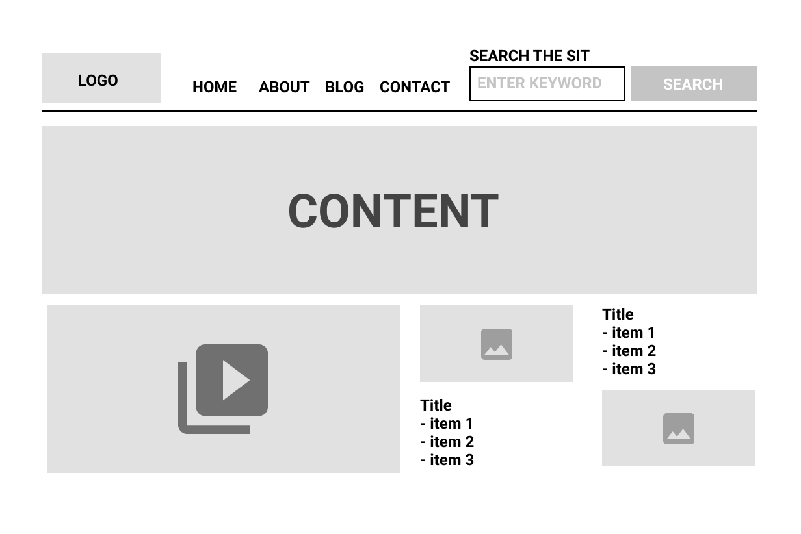
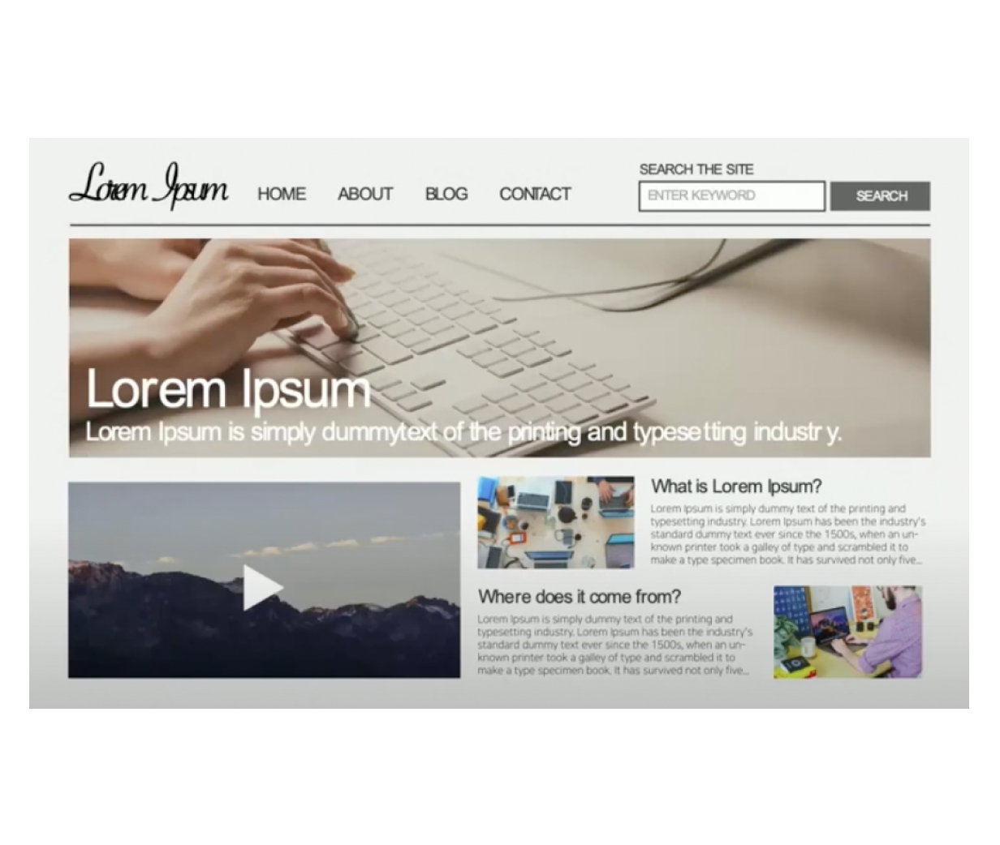

# Atomic design

## 아토믹 디자인이란?

**아토믹 디자인 패턴**은 `체계적인 방식으로 디자인 시스템을 구축할 수 있는 방법론`을 말한다.

쉽게 말하자면, 디자인 요소들을 나누어 파악하고 이 요소들이 조합되는 과정을 통해서 디자인을 구성하는 방식을 의미한다.

 

    

 

기본 페이지별로 나누는 것은 같지만 `원자(atom)` -> `분자(molecule)` -> `유기체(orginism)` -> `템플릿(template)` -> `페이지(page)`의 순서로 컴포넌트를 붙여가며 단위를 키워 가는 방식으로 진행된다.

용어를 보니 화학에서 비롯된 개념인 듯하다.

화학에서는 우주의 모든 물질은 원자로 구성되어 있고, 원자 단위는 서로 결합하여 분자를 형성하고, 차례로 더 복잡한 유기체로 결합하여 궁극적으로 모든 물질을 생성하는 것이라고 한다.

빗대어 표현하자면 원자 → **html 태그** , 분자, 유기체 → **컴포넌트** , 모든 물질 생성 → **페이지**를 말하는거 같다.

이 말은, html 태그들을 합쳐져서 컴포넌트를 만들고 최종적으로 페이지를 만드는 느낌이라고 할까..?

즉, 각 페이지는 컴포넌트(또는 HTML 요소)로 분해될 수 있으며, 분해된 컴포넌트는 화학에서 가리키는 분자, 유기체와 유사하다.

그렇게 때문에 만약 컴포넌트 기반인 리액트에 이 디자인 패턴을 사용한다면 굉장히 효율적인 디렉터리 구조를 만들 수 있다고 한다.

 
 

## Why 아토믹 디자인을?

나는 평소 프로젝트를 진행했을 때 관련도가 높은 파일들로 묶어 페이지별로 디렉터리 구조를 구성하는 편이였다.

그런데 페이지 별로 나누게 되면 각 페이지에서 똑같이 사용되고 있는 UI 로직을 많이 발견하곤 했다.

그럴 때마다 똑같은 코드를 복사 붙여 넣는 방식으로 진행을 했었고, 이러한 방식들은 너무 비효율적이라고 생각했다.

또 프로젝트가 점점 커질수록 똑같은 코드들이 많아져 코드가 길어지고 이를 관리하는 것은 너무나 힘들었다.

그래서 `재사용 가능한 컴포넌트`에 대해서 많은 고민을 하게 되었다.

다른 방법을 찾아보던 중 아토믹 디자인 패턴을 발견하게 되었고, 컴포넌트 중심인 리액트의 특성과 잘 맞아 떨어지는 것 같아 공부 중이다.

 
 

## 아토믹 디자인 설계에는 5가지 단계가 존재

### atom

- 원자는 모든 컴포넌트들의 기초가 되는 블록이며, 더 이상 분해될 수 없는 필수 요소이다.
- 웹 인터페이스에 적용되는 `label`, `input`, `button`과 같은 **HTML 태그 단위**
- 색상, 글꼴 및 애니메이션과 같은 CSS 요소들이 포함될 수 있다.

 

    

 

### molecules

- 분자는 원자들이 서로 결합된 그룹을 말하며, 하나의 단위로 함께 동작하는 UI 컴포넌트들의 단순한 그룹이다.
- 앞의 원자인 `label`, `input`, `button` 태그들이 함께 결합하면 `하나의 검색창`을 만들 수 있다.
- `하나의 검색창 === 분자`
- 일반적으로 `재사용을 위해 만들어진 비교적 단순한 원자 조합`이라고 할 수 있다.

 

    

 

### organisms

- 여러 개의 원자들과 분자들을 결합하여 유기체를 형성한다.
- 유기체는 유사하거나 다른 분자 유형으로 구성될 수 있다.
- `Hearder`, `NavBar` 와 같은 컴포넌트들을 말한다.

 

    

 

### template

- 여러 개의 다른 유기체 그룹으로 구성되며 디자인 HTML 전체적인 레이아웃 구조를 말한다.
- 페이지에 표시될 레이아웃 구성 요소라고 볼 수 있다.

 

    

 

### page

- 템플릿의 구체화된 인스턴스가 바인딩 되어 유저에게 보이고 사용되고 리뷰될 단계를 말한다.
- 실제 데이터 혹은 더미 데이터를 넣어 특정 인스턴스 페이지를 만든다.
- 따라서 전체적인 로직이나 상태 등을 page 레벨에서 컨트롤해야 한다.

 

    

 

 
 

## 만약 이 패턴으로 웹을 만든다면?

 

    

 

 
 

## 👨🏻‍💻 앞으로 다음 계획은?

나는 이전 프로젝트에서 컴포넌트 재사용성에 대해 불편함을 느껴 짧지만 글을 쓰면서 아토믹 디자인 패턴에 대해서 알게 되었다.

그래서 나는 이 아토믹 디자인 패턴을 적용해 볼 것이다.

그 프로젝트 대상은 이전에 부트 캠프에서 간단히 인스타스램을 클론한 적이 있다.

연습도 할 겸 그 프로젝트에 이 디자인 패턴을 연습할 것 같다.

그렇기 때문에 인스타그램 클론 프로젝트에 대해서도 포스팅을 할 계획이다.

 
 
 

## ✔️ 참고

[Atomic Design](https://bradfrost.com/blog/post/atomic-web-design/)

[Atomic Design for React](https://medium.com/@inthewalter/atomic-design-for-react-514660f93ba)

[atomic design 파헤치기](https://simsimjae.tistory.com/407)
