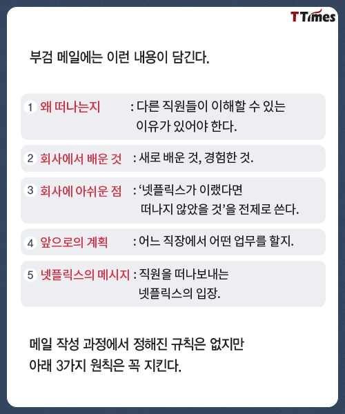

# 지난 6개월을 돌아보며...

6개월 전 나는 부트 캠프를 수료하고 취업 준비를 하고 있었다.

하루하루 많은 면접과 코딩 테스트, 과제와 전쟁을 치르고 있었다.

 

    

 

그렇게 점점 지쳐갈 무렵 `한 통의 카톡`이 왔다.

 

    

 

그 톡은 바로 부트 캠프에서 같이 프로젝트를 진행했던 회사 대표님의 톡이었다.

대표님께서 나에게 지금 현재 무역 B2B 서비스를 만들고 있는데 같이 만들어 보는 것이 어떠냐는 제안을 주셨다.

나는 사실 대표님께서 오래전부터 무역 B2B 서비스를 기획하셨던 것을 알고 있었다.

그리고 그 서비스를 만들기 위해 부트 캠프에 참여했던 것 또한 알고 있었다.

이 제안을 주신 것에 대해 나는 너무 고맙기도 했지만 한편으론 내가 할 수 있을까에 대해 걱정되기도 했다.

대체 나의 어떤 점 때문에 이런 제안을 주신 것일까?.. 궁금하기도 했다.

하지만 나는 이 좋은 기회를 놓칠 수 없기에 진행 중이던 면접과 과제를 당장 중단하고 바로 합류하겠다고 톡을 보냈다.

다행히도 팀원들 또한 부트 캠프에서 만났던 분들이라 바로 적응하는데 문제가 없었다.

그렇게 나는 2020년 10월 7일부터 초기 스타트업에서 인턴 생활을 하게 되었다.

 
 

### 길다면 길고 짧다면 짧은 6개월의 시간... (순삭)

정말 눈 깜짝할 사이에 시간은 정말 빠르게 흘러갔고, 어느덧 계약에 대해 다시 결정할 시간이 다가오고 있었다.

나는 그 사이 정말 많은 고민을 하며 점점 회사를 떠날 마음의 준비를 하고 있었다.

그렇게 2021년 4월 6일 되는 날, 나는 다시 취준생으로 돌와왔다.

사실 회사에서는 이젠 팀원으로써 같이 하기를 원했지만, 나는 이 제안에 대해 정중히 거절하게 되었다. 😂

 
 
 

# 그렇다면 왜 거절했는가?

이유를 말하기에 앞서, 넷플릭스의 퇴사 문화인 `"부검 메일"` \*\*\*\*의 양식을 통해서 순서대로 작성해보려고 한다.

 

    

 
 
 

# 1. 왜 떠나는지

사실 나는 경력 1년도 채 되지 않은 파릇파릇한 신입 개발자다.

그래서 다들 1년까지만 다녀보라고 말한다.

그런데도 내가 회사를 떠나야 했던 가장 큰 이유는 바로 `나 자신의 성장` 때문이었다.

사실 회사를 떠나기 전 날까지도 회사는 비대면 정부 지원 바우처 사업에 선정되어 날이 갈수록 폭풍 성장을 하고 있었다.

분명 회사가 성장하고 있었기에 이 부분에 대해서 보통 다들 이렇게 생각할 것이다.

`회사가 성장하면 나 또한 똑같이 성장하지 않냐라고..`

하지만, 슬프게도 나는 회사와 똑같은 속도로 성장하진 못했다.

나는 **어느 유명 개발자 블로그**에서 이런 문구를 본 적이 있다.

흔히 `스타트업에 합류하는 것`을 `로켓에 올라타는 것`으로 비유하는데요.
로켓이 보인다면 자리가 어디가 됐든 올라타라라는 말은 스타트업에서 굉장히 유명한 문구입니다.
하지만 회사가 성장하는 만큼 본인이 성장하지 못한다면 본인이 앉은 자리는 `로켓의 연료통`일 수도 있습니다.

뭔가 머리를 한 방 맞았다고 할까..? 이 문구가 정말 너무나도 나에게 와닿았다.

또, `"회사의 성장과 나 자신의 성장 속도는 비례하지 않았다."` 와

잔인하게도 `"회사의 성장과 무관하게 자신의 성장을 챙기지 못한다면 이후에 본인이 설자리가 더이상 없다."` 라는 문구도 내 머리를 두 방, 세 방 더 때렸다.

 

    

 

어느 순간 나는 정신 차리고 보니 내 성장에 대해서 계속 의심하고 있었고, 끉임없이 고민한 끝에 여기서는 성장할 수 없을 것 같다는 판단을 하게 되었다.

그래서 나는 떠나게 되었다.

 

    

 
 
 

# 2. 회사에서 배운 것

나는 회사를 다니면서 대체적으로 개발적인 것보단 다른 부분들에 대해서 많이 배울 수 있었다.

 

## 디자이너와 협업

사실 회사 내에서 디자이너는 없었다.

그래서 대표님께서 기획과 디자인을 담당했었고, 거기에 백엔드 개발까지도 담당하고 있었다.

하지만 그때 당시 디자이너의 필요성을 절실히 느꼈는지 대표님께서 아시는 디자이너 분에게 부탁해 그분과 작업을 하게 되었다.

같이 작업을 하면서 `재사용 할 수 있는 컴포넌트 만드는 방식`과 `Figma`라는 디자인 툴에 대해 배울 수 있었다.

프론트엔드 개발자와 디자이너가 협업했을 때 필요한 다른 부분들에 대해서 많은 것을 배울 수 있었다.

 
 

## 방향성

내가 스타트업에서 일을 하면서 느낀 점은 `정말 뛰어난 사람들이 모여 함께 일하는 곳`이라는 점이다.

그래서 나는 이 스타트업이라는 곳에서 일을 하면서 내가 이 사람들과 같이 일해도 되는건가..? 라는 생각을 한 적이 정말 많았다.

그리고 실력이 뛰어나지 않았던 탓인지 처음에는 실수도 많이 하고 자존감이 많이 떨어졌었다.

그렇지만 나는 이 계기로 인해 `나를 객관화`할 수 있었다.

실수를 하지 않기 위해 실수 노트도 따로 만들어서 관리했고, 자존감을 높이기 위해 내가 어떤 부분을 잘하고 어떤 부분이 부족한지를 찾아 보안하려고 노력하게 되었다.

내가 어떻게 공부를 해야하는지에 대한 `방향성`을 잡아주었다.

 
 

## 일하는 태도

나는 일을 할 때 의견을 내세우거나 혹여나 의견을 내더라도 끝까지 밀고 나가는 성격이 아니었다.

그래서 모든 의견에 대해 거의 수긍하는 편이였다.

하지만 이렇게 일을 하다 보니, 어느 순간 내가 성과를 낼 수 있는 업무를 하지 못하는 경우가 많았다.

흔히 말해 중요한 일 거리들은 다 가져가고 남은 일만 하는 경우가 많았다.

하지만 나도 내 밥그릇을 챙겨야 했기에 어느 순간부터 의견을 내면서 나도 내 몫을 챙겨가며 일을 하려고 하고 있었다.

그때부터 나는 말을 하지 않으면 사람들은 아무도 모른다는 것에 대해 많이 깨달았다.

일을 함에 있어서 `본인의 의견을 말하는 것`은 정말 중요하다는 것을...

그 부분에 대해서 많은 것을 느꼈다.

 
 

# 3. 회사에 아쉬운 점

## 처음부터 끝까지 만들어 볼 수 있는 경험이..?

회사에 처음 합류했을 당시, 나는 스타트업이기에 모든 것을 하나부터 순차적으로 만들고 배포까지 하는 경험을 생각했다.

하지만 들어오고 보니 어느 정도 대부분 개발은 되어 있었다.

그래도 개발할 feature들이 많았기에 나에게 주어진 개발에 대해 최선을 다했다.

하지만 어느 순간부터 내 역량이 부족해서 그런지 내가 하는 업무의 대부분은 코드 유지 보수 작업과 퍼블리싱 작업이 되어버렸다.

이 부분이 내가 퇴사를 생각하게 된 가장 큰 이유이기도 하다.

시간이 많이 걸리더라도 개발적으로 뭔가 더 했으면 좋았을 텐데라는 아쉬움이 많이 있다.

 
 

## 이끌어 주는 리더의 부재

회사 내에서 기술적으로 이끌어 줄 리더는 사실 없었다.

대신 같은 경력의 뛰어난 동료가 있었다.

하지만 나는 그 친구를 `주방장 같은 개발자`라고 말하고 싶다.

주로 주요 기능 개발에는 자신, 혹은 신용이 있는 사람에게만 맡기고, 상대적으로 배울 수 있는 부분이 적은 손이 많이 가는 일들은 나에게 주었다.

물론 식재료 손질하기, 청소하기, 설거지하기 등은 요리하는 사람의 기본기가 될 수 있겠지만, 이 일만 계속한다고 해서 절대 주방장이 될 수 없다.

 

    

 

그래서 그랬는지 이렇게 계속 일을 한다면 성장하기 어렵겠다는 생각을 많이 하게 되었던 것 같다.

또 일을 하면서 수평 관계보다는 수직 관계와 같은 느낌이 더 강했기에 함께 만드는 느낌 또한 확실히 덜했다.

하지만 빠른 성과를 내야 하는 초기 스타트업이 이게 어쩔 수 없었던 구조라는 생각도 든다.

 
 
 

# 4. 앞으로의 계획

    

 

퇴사 후 계획은 사실 구체적으로 정해 놓진 않았다.

그냥 알바나 하면서 다시 준비해야지...라고 생각만 하고 있었다.

그런데 뭔가 물 흐르는 대로 퇴사 일주일 전부터 기술 면접 스터디에 들어가게 되었고,

또 일주일 지나서 서비스 배포까지 할 수 있는 프로젝트 팀에 합류하게 되었다.

그래서 앞으로의 계획은 스터디를 하면서 부족했던 개발 지식을 쌓고, 프로젝트를 하면서 새로운 기술들과 기존에 썼던 기술에 대해 정리하며 진행할 예정이다.

그리고 이제껏 못 가본 국내 여행도 갈 준비를 하고 있다.

그러고 이제 어느 정도 준비가 되었을 때, 그때 다시 회사에 지원할 생각이다.

 
 
 

# 5. 회사의 메시지

퇴사 전날에 회사 사람들과 같이 많은 이야기를 했다.

사실 더 같이 했으면 좋겠다는 아쉬움이 크다고 말해주셨다.

그리고 고맙게도 앞으로 살아가면서 필요한 조언들과 나에 대한 피드백도 또한 해주셨다.

정말 감사했다.

나중에 기회가 된다면 경력을 쌓고 제대로 된 테스트를 걸쳐 다시 입사하겠다고 했다. (하하.. 😄)

 

    

 
 
