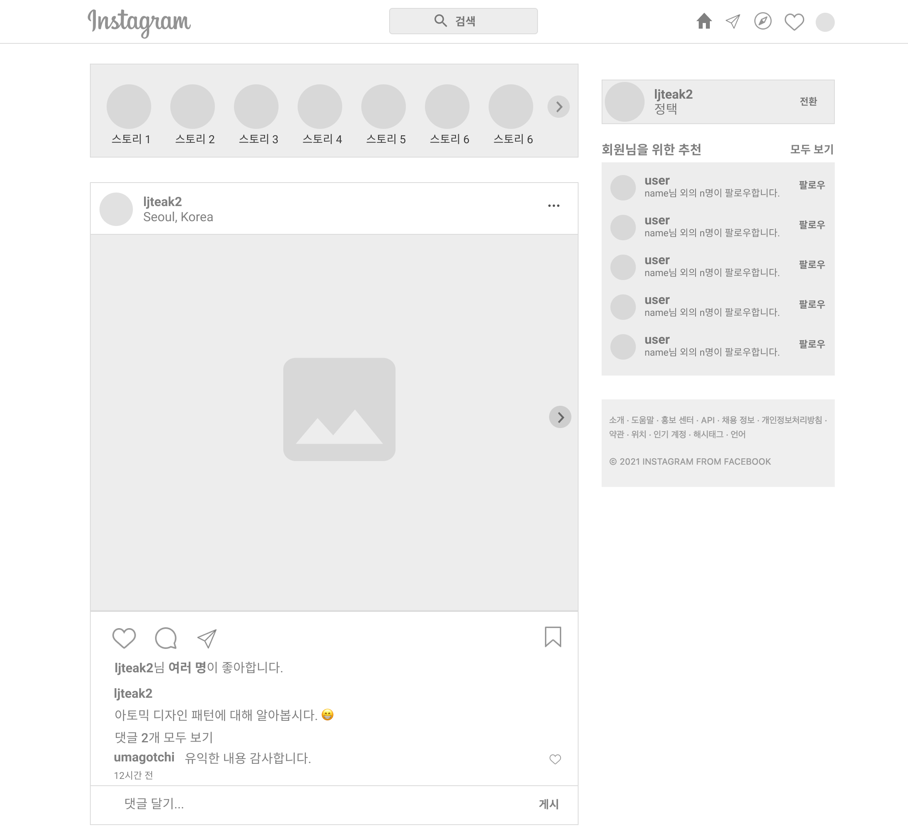
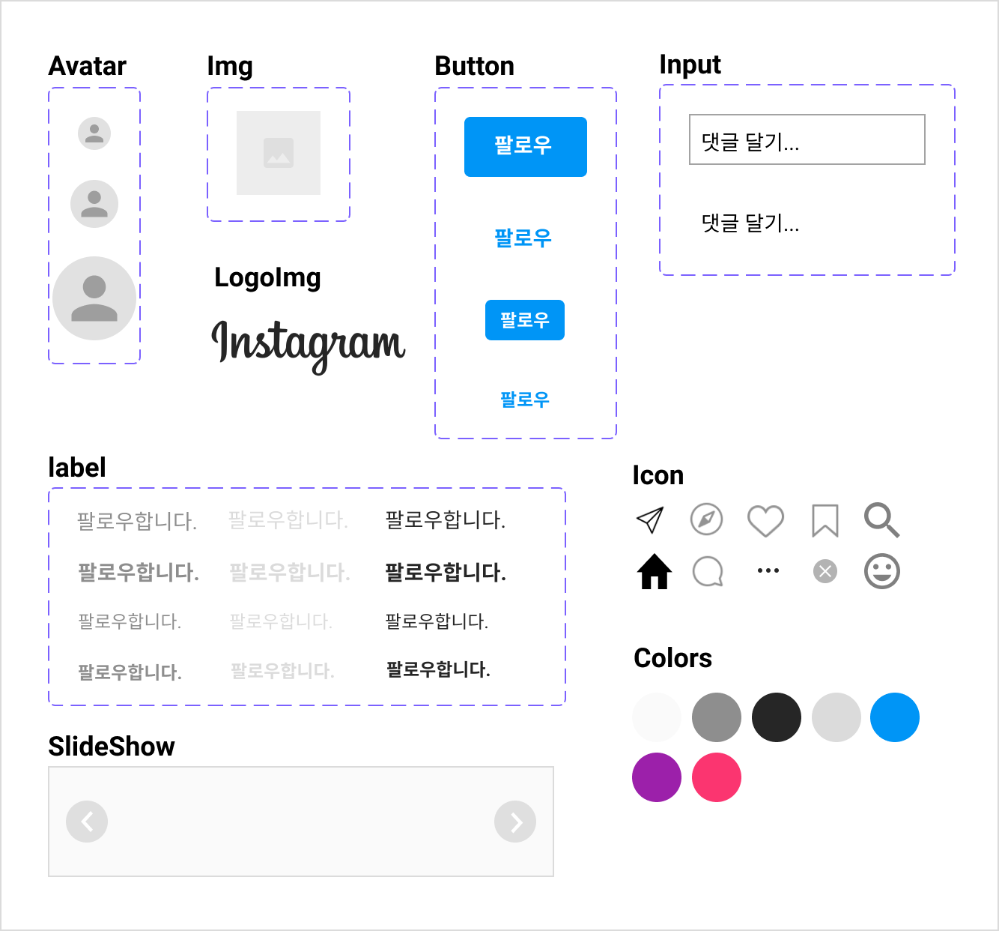
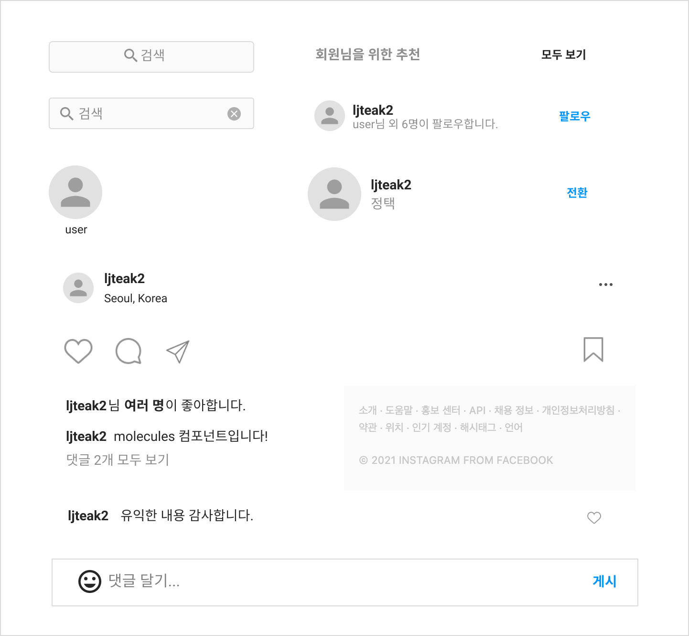
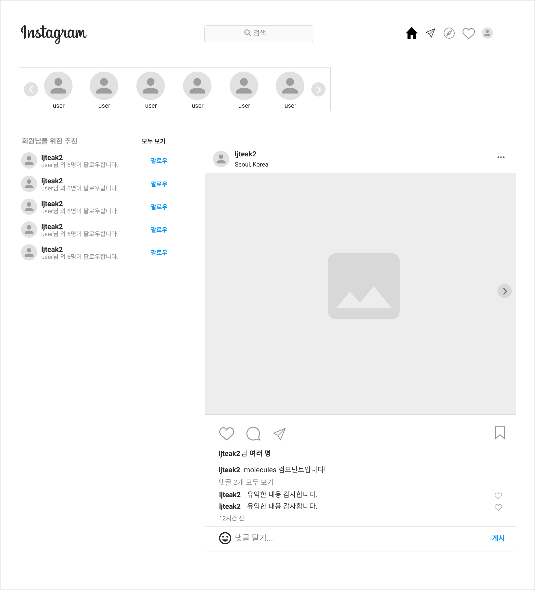
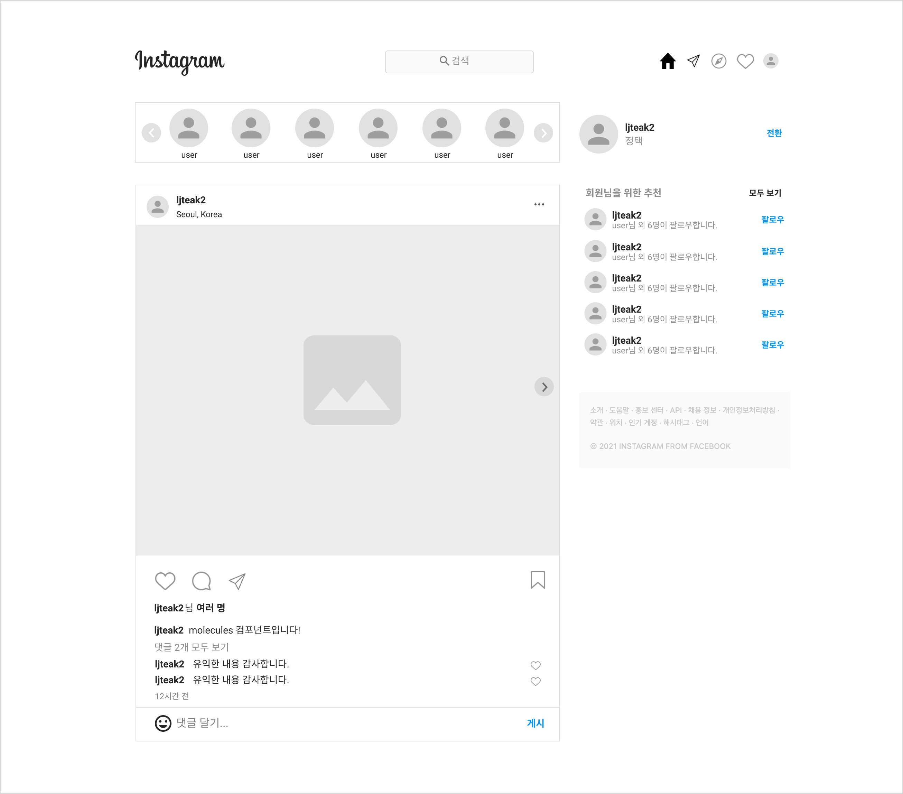

# 기존의 인스타그램 클론 프로젝트는 이랬다...

나는 react를 처음 접했을 당시에 인스타그램을 간단히 클론 해본 적이 있다.

그때 당시에는 관련도가 높은 파일들로 묶어서 페이지별로 디렉터리를 나눠서 진행했었다.

그리고 scss를 사용해 스타일을 입혔었다.

```bash
# 기존 디렉터리 구조

├─components
│      Comment.js
│      Comment.scss
│      Feed.js
│      Feed.scss
│      Footer.js
│      Header.js
│      Header.scss
│      StoryItem.js
│      StoryItem.scss
│
├─images
│      bookmark.png
│      comment.png
│      dm.png
│      explore.png
│      heart.png
│      logo.png
│      logo_text.png
│      more.png
│      my.jpg
│      profile.png
│      share.png
│
├─pages
│  ├─Login
│  │      Login.js
│  │      Login.scss
│  │
│  ├─Main
│  │      Main.js
│  │      Main.scss
│  │
│  └─Signup
│          Signup.js
│          Signup.scss
│
└─styles
        common.scss
        reset.scss
```

<br />
<br />

# 📌 이번 리팩토링의 목적

1. 이전에 적용했던 디렉터리 구조 방식을 `아토믹 디자인 패턴` 방식으로 바꿔보기.
2. 기존에 scss 방식에서 한 번도 써보지 않은 `react-emotion`을 사용해 스타일을 입혀보기.

<br />
<br />

# 바로 아토믹 디자인 패턴을 적용해보자.

우선 만들기 전에 먼저 Figma를 통해서 인스타그램 웹 구조를 먼저 잡아보았다.

그리고 겸사 겸사 연습도 할 겸 인스타그램 와이어 프레임도 간단히 만들어보았다.

<br />

## 짜잔!

<br />
<div align="center">
    
</div>
<br />

우선 페이지는 인스타그램 로그인했을 때 바로 보이는 페이지 **딱 하나**만 만들 예정이다.

<br />

### **한 페이지로만 한 이유는..?**

아직은 아토믹 디자인 패턴을 처음 적용하는 것이기 때문에 많은 페이지를 만드는 것이 부담이 될 것 같았다.

<br />
<br />
<br />

## 이제 5가지 원칙으로 컴포넌트를 나눠보자.

### **Atom(원자)**

원자는 페이지에서 `가장 작은 단위`를 의미한다.

실제로 원자를 만들어 보았는데 고민을 많이 해서 그런지 생각보다 시간이 굉장히 오래 걸렸다.

하지만 가장 작은 단위인 만큼 최대한 어디에서든 `재사용할 수 있게 설계`하려고 많은 고민을 했다.

내 나름대로 크기, 색깔, 테두리 등등 props로 설정하여 재사용 하도록 설계했다.

<br />
<div align="center">
    
</div>
<br />
<br />

### **Molecule(분자)**

분자는 앞에서 만든 `원자들이 결합되어 만들어진 단위`를 말한다.

분자를 만드는 과정에서 원자를 기반으로 만들면 되기 때문에 "분자는 금방 만들겠구나" 라는 생각을 했다.

하지만 그 반대로 원자를 만들 때보다 분자를 만들 때가 훨씬 많은 시간이 걸렸다.

그중 가장 많은 시간이 걸렸던 부분은 바로!

**하나의 분자에서 여러 가지 동작을 처리할 수 있는지..? 이 부분이다.**

분명 어떠한 이벤트나 전달받은 데이터에 따라 재사용하지 못하고 새로운 분자들을 만들어야 하는 경우가 종종 있었다.

그 순간 "하나를 더 만들까? 아니면 분자 하나를 가지고 다 처리할까..?" 라는 많은 고민을 했다.

하지만 찾아본 결과, 원자에서 분자를 만드는 것은 `"한 가지만 하고 그거 하나만 잘해라"`는 사고방식을 권한다고 한다.

그래서 가급적 많은 곳에서 재사용되도록 컴포넌트를 구성하되 `"한 가지 일을 한다"`라는 원칙을 지키며 만들었다.

<br />
<div align="center">
    
</div>
<br />
<br />

### **Organism(유기체)**

유기체는 `원자와 분자들을 조합해서 만들어진 단위`를 말한다.

하지만 경우에 따라서 분자와 분자끼리 결합해서 만들 수도 있고, 유기체와 유기체를 결합해서 또 하나의 유기체도 만들 수 있다고 한다.

오히려 분자를 만들 때보다 유기체를 만들 때가 훨씬 수월했다.

하지만 여기서도 고민을 했던 부분은 이 컴포넌트는 과연 분자인가? 유기체인가?

애매한 부분이 있어 고민을 많이 했었다.

그래서 이 부분에 대해서 나름의 기준을 주었다.

- 분자는 데이터를 표시하고 이벤트를 받을 수 있지만 `"하나의 역할"`만 하는 경우
- 유기체는 사용자에게 의미를 가지는 `"기능적 요구사항"`에 포함되는 경우

<br />

### 💡 여기서 기능적 요구 사항은?

기능적 요구 사항을 예를 들면, 이러한 요구 사항들을 말한다.

- 사용자는 인스타 스토리 리스트를 본다.
- 인스타 스토리 리스트는 주기적으로 변경된다.

이러한 경우 분자가 아니라 유기체로 분리했다.

<br />
<div align="center">
    
</div>
<br />
<br />

### **Template**

템플릿은 `유기체들의 조합으로 구성된 단위`를 말한다.

하지만 필요에 따라 이 부분도 원자나 분자들을 유기체와 조합시켜 만들 수도 있다고 한다.

이 단계는 `실제 데이터가 입혀지기 전 UI 요소, 레이아웃`이라고 보면 된다.

템플릿 단계에서는 미리 만들어 논 유기체들을 가지고 손쉽게 만들 수 있었다.

이래서 아토믹 디자인 패턴을 사용하는 건가? 라는 생각도 들었다.

<br />
<div align="center">
    
</div>
<br />
<br />

### **Page**

페이지 단위는 `실제로 화면에 보여줄 데이터를 받아오는 단계`이다.

이 부분에서 api를 호출해 데이터를 받아서 실제 데이터를 화면에 보여주도록 처리한다.

하지만 리팩토링 과정에서 실제 호출할 수 있는 api가 없었다.

공개 api를 사용도 할까 생각했지만, 페이지 하나만 만들어서 진행하는 것이기 때문에 가짜 데이터를 json 형식으로 직접 만들어서 처리하기로 했다.

<br />
<div align="center">
    
</div>
<br />
<br />
<br />

# ✏️ 실제 적용하고 나서 느낀 점!

이번 리팩토링을 계기로 기존 파일 구조 방식을 아토믹 디자인 패턴으로 바꾸고, scss로 적용된 스타일 방식을 emotion으로 바꿔보았다.

우선 먼저 Figma를 통해 직접 화면을 그리고 컴포넌트를 나눠서 진행해 보았는데 이 과정에서 디자이너가 어떤 식으로 작업하는지 잠깐 동안 체험할 수 있었다.

물론 디자이너 관점이 아닌 프론트엔드 개발자의 관점으로 컴포넌트를 나눠 진행해서 시간이 꽤나 오래 걸리긴 했지만.. 하하

그리고 Figma라는 디자인 툴을 쓰면서 느낀 건 확실히 개발 친화적인 툴이라는 생각을 했다.

그 이유는 컴포넌트라는 개념도 있고, 상태 값을 통해서 디자인을 바로바로 변경할 수 있는 점에서 프론트엔드 개발과 상당히 굉장히 비슷했기 때문이다.

그리고 또 스타일을 입히는 부분에 있어서 평소에 나는 scss를 쓰지 않고 styled-component를 사용해 프로젝트를 진행해 왔었다.

그러다 이번에 리팩토링하면서 처음으로 emotion을 써보게 되었다.

emotion 공식 문서를 보면서 굉장히 놀라운 사실을 발견했다.

css props 방식 이외에도 styled-component와 같은 컴포넌트 방식으로 스타일을 입히는 기능이 있어서 깜짝 놀랐다.

그리고 또 그 외에도 스타일을 입히는 방법이 좀 더 다양했다.

"엇.. 이럴 거면 이제부터 프로젝트를 진행할 때 emotion으로 해볼까??" 라는 생각도 살짝 들었다.

<br />
<br />

## 아토믹 디자인 패턴 적용

### 👍🏻 **장점**

- 굳이 페이지마다 스타일을 줘서 커스텀 할 필요 없이 바로바로 재사용이 가능하다.
- 같은 UI와 같은 로직을 가진 컴포넌트가 페이지 별로 사용될 경우 따로 고칠 필요 없이 컴포넌트 하나에서 고치면 모두 반영된다.
- 일관성 있는 코드 덕분에 여러 명이서 협업할 경우 알아보기가 편하다.

<br />

### 👎🏻 **단점**

- 컴포넌트 이름 짓기가 까다로웠다.
- 컴포넌트 나누는 기준 애매해지는 경우가 생겨 시간이 오래 걸렸다.

  → 이 부분은 디자이너와 협업했을 때 해결될 문제라고 생각한다.

- 총 5단계로 이루어져 있어 props를 전달, 전달하다 보니 의도치 않은 오류가 많이 발생했다.

  → 이 부분 또한 타입스크립트를 적용하면 해결될 것 같다.

<br />
<br />

## Emotion 사용해 스타일 입히기

### 👍🏻 **장점**

- CSS-in-js 중에 스타일을 입히는 방식이 좀 더 다양하기 때문에 확장성이 뛰어나다.

<br />

### 👎🏻 **단점**

- 국내에서는 아직 자료가 많지 않아 공식 문서나 외국 자료를 보면서 해야 하기 때문에 초기 러닝 커프가 살짝 높을 수 있다.

<br />
<br />

## 👨🏻‍💻 리펙토링 소스 참고

[wjdxor133/Wecolas](https://github.com/wjdxor133/Wecolas)

[wjdxor133/Wecolas-Refactoring](https://github.com/wjdxor133/Wecolas-Refactoring)

<br />
<br />
