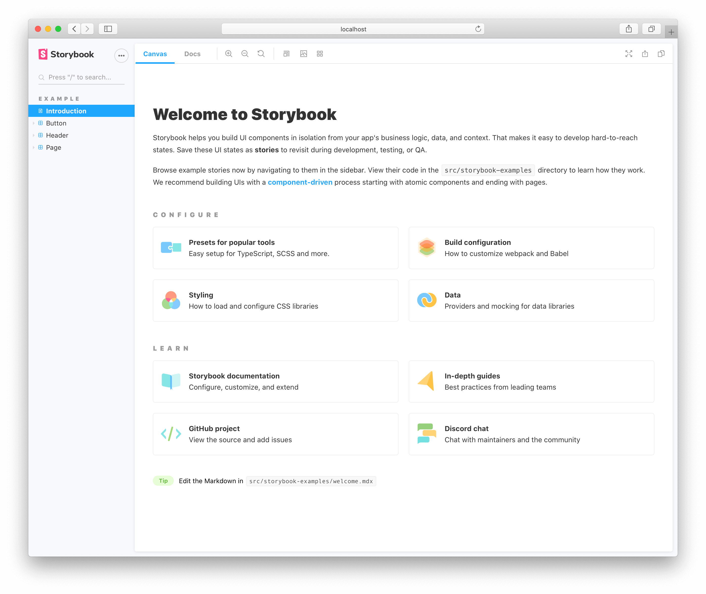
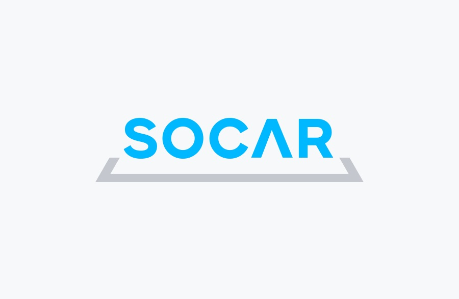
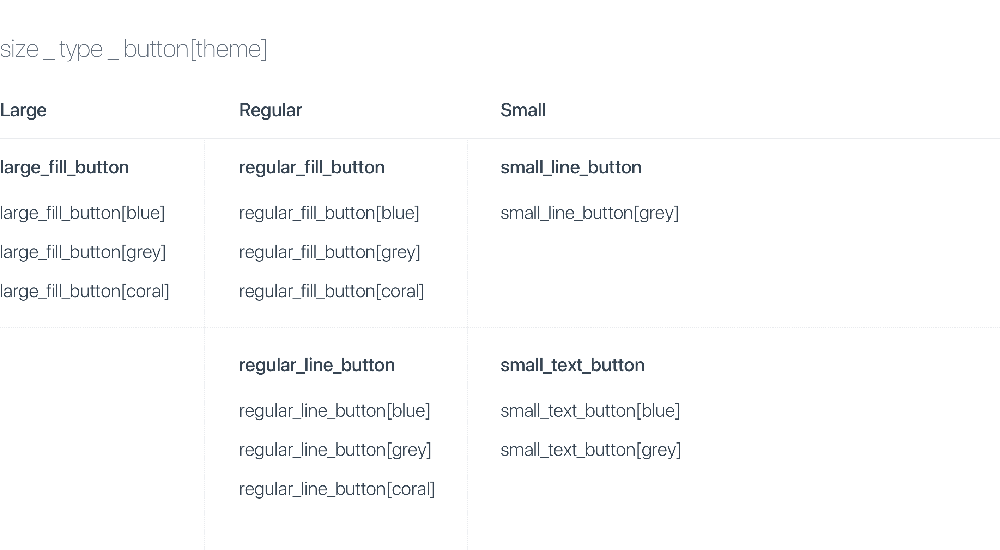
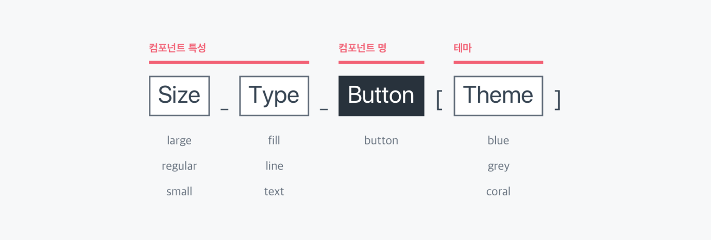
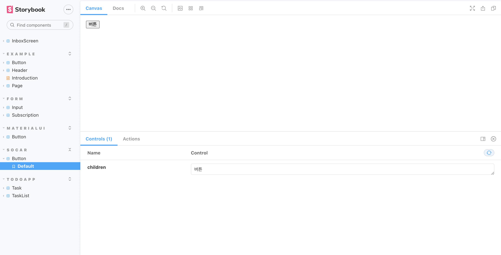
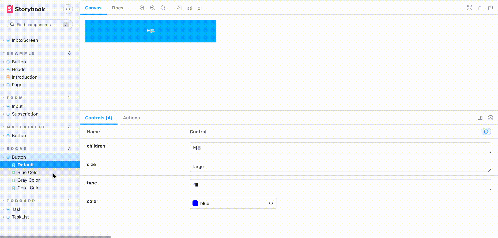
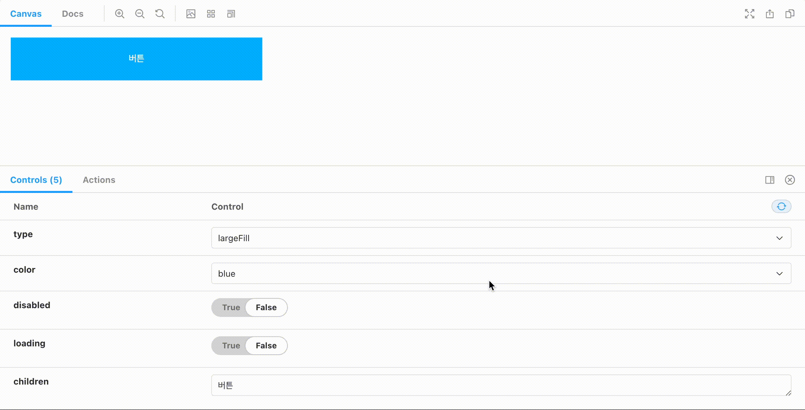
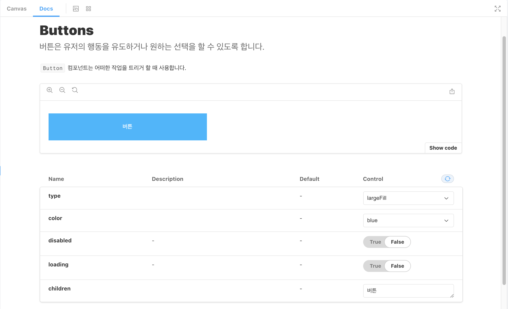
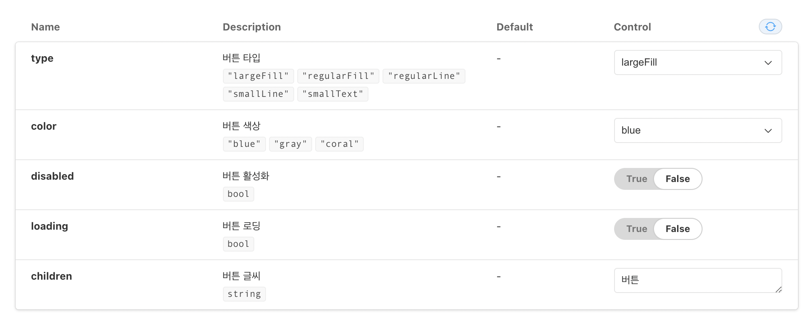
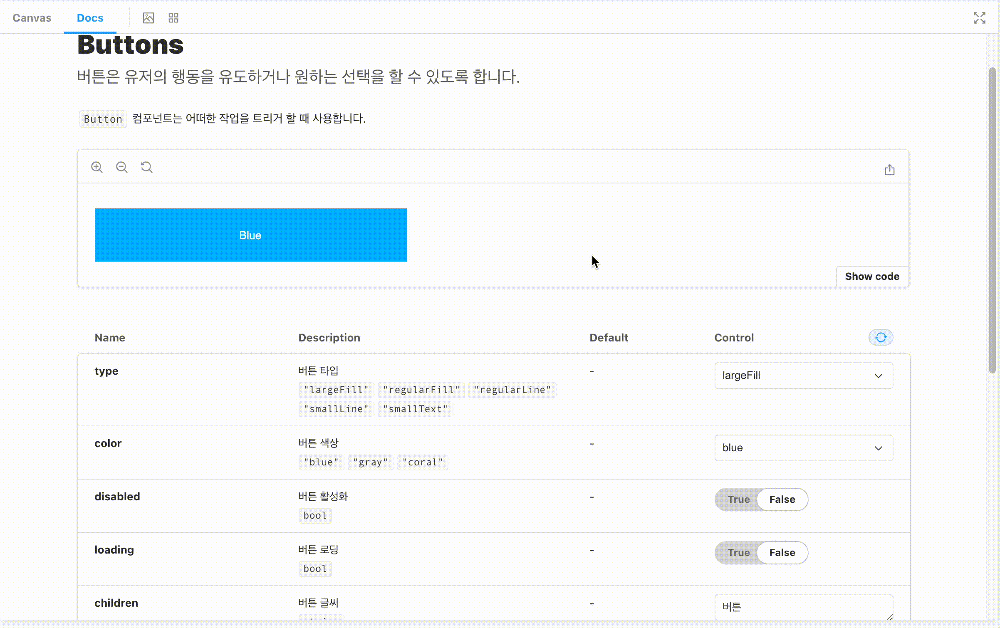

# 스토리북이란?

`Storybook`은 화면에 렌더링 되는 **분리된 UI 컨포넌트를 체계적이고 효율적으로 구축할 수 있고 문서화할 수 있는 툴**을 말한다.

보통 UI 컴포넌트 개발과 동시에 자동으로 문서를 생성해야 할 때 사용된다.

<br />
<br />

# 스토리북을 왜 써야 하는가?

팀이 성장하고 프로젝트가 커질수록 같이 일하는 팀원끼리의 `커뮤니케이션`이 굉장히 중요하다.

필자도 이전에 스타트업에서 근무했을 때, 이러한 커뮤니케이션 문제 때문에 팀원들에게 계속 물어보게 되어 서로의 업무 생산성을 떨어뜨린 적이 있다.

하지만 스토리북을 사용 함으로서, 팀원끼리 커뮤니케이션을 잘 하려면 프로젝트에서 사용되는 컴포넌트를 미리 정리하고 일회용 컴포넌트의 사용을 줄일 수 있다.

즉, 스토리북은 컴포넌트를 재사용 할 수 있는 디자인 시스템 `"사용자 설명서"`라고 볼 수 있다.

또 스토리북을 사용하게 되면 다양한 컴포넌트 종류를 이미 문서화된 스토리로 접할 수 있기 때문에 새로 합류한 팀원이 작업을 수월하게 시작할 수 있다.

왜냐하면 스토리북은 컴포넌트가 어떻게 주어지는 다양한 입력(props)과 함께 어떻게 동작하는지를 문서로 보여주고, 또 여러 프로젝트에 동일한 UI 코드를 붙여 넣지 않고, 표준회 된 UI 컴포넌트를 재사용하게 된다.

팀의 업무 생산성을 높이고 싶다면 스토리북을 사용해 보는 것을 추천한다.

<br />
<br />

# STORYBOOK RUN START!

## 설치 방법

```bash
# Add Storybook:
npx -p @storybook/cli sb init
```

<br />

## 초기 프로젝트 구성

설치가 완료되면 다음과 같은 디렉터리가 프로젝트 루트에 자동 생성된다.

- **.storybook**: Storybook 설정 파일이 포함되어 있다.

```bash
.storybook
 └── main.js
 └── preview.js
```

- **src/stories**: Storybook 예제 컴포넌트

```bash
src/stories
└── assets
		└── button.css
		└── Button.js
		└── Button.stories.js
		└── header.css
		└── Header.js
		└── Header.stories.js
		└── Introduction.stories.mdx
		└── page.css
		└── Page.js
		└── Page.stories.js
```

기본 설정 파일에는 `main.js` 와 `preview.js` 두 가지가 있다.

<br />

### **main.js**

먼저 `main.js` 이 파일은 Storybook 서버의 동작을 제어할 수 있는 파일이다.

단, 변경 시 Storybook의 프로세스를 다시 시작해야 반영된다.

```jsx
// .storybook/main.js
module.exports = {
  stories: ["../src/**/*.stories.@(js|mdx)"],
  addons: ["@storybook/addon-essentials"],
};
```

<br />

### **preview.js**

`config.js` 를 대체하며, stories의 렌더링을 설정한다.

단, `config.js` 와 달리 `preview.js` 는 어떠한 stories의 로딩도 책임지지 않는다.

주 목적은 global parameters와 decorators를 추가하는 것이라고 한다.

```jsx
//.storybook/preview.js
export const parameters = {
  actions: { argTypesRegex: "^on[A-Z].*" },
  options: {
    storySort: (a, b) =>
      a[1].kind === b[1].kind
        ? 0
        : a[1].id.localeCompare(b[1].id, undefined, { numeric: true }),
  },
  controls: {
    matchers: {
      color: /(background|color)$/i,
      date: /Date$/,
    },
  },
};
```

<br />

### 실행 방법

아래 명령어를 통해서 실행한다.

```bash
# Starts Storybook in development mode
npm run storybook
```

<br />

### 실행 화면

<div align="center">
    
</div>
<br />

<br />
<br />

# 이제 직접 만들어보자!

가장 좋은 대표적인 예시로 `Button 컴포넌트` 를 만들어 볼 예정이다.

버튼 스타일은 `styled-component` 를 사용해서 입혀볼 것이다.

<br />

## 파일명 짓기

파일 이름은 `<컴포넌트>.stories.js` 혹은 타입스크립트 일 경우에는 `<컴포넌트>.stories.ts` 로 작성한다.

보통 스토리는 컴포넌트 파일과 같은 디렉터리 안에 작성한다.

여기서는 자바스크립트를 사용할 것이기 때문에 `<컴포넌트>.stories.js` 으로 이름을 지어 볼 것이다.

```bash
# 디렉터리 구조
└── src
 └── components
 └── Button
	 ├── Button.js
	 └── Button.stories.js
	 └── Button.styles.js
```

막상 이렇게 만들어 놓고 시작하려고 하니 생각보다 막막했다.

아무래도 `컴포넌트에 대한 정해진 스타일 가이드` 가 없기 때문에 진행하기 쉽지 않았다... 😭

그래서 열심히 핀터레스트에서 찾거나 계속 구글 검색을 하던 중에 좋은 예시를 찾았다.

바로 요즘 핫한 셰어 카 서비스를 운영하는 `쏘카(socar)`!

<br />
<div align="center">
    
</div>
<br />

스타일 가이드가 굉장히 잘 되어 있어서 이걸 참고해서 만들면 순조롭게 만들 수 있을 것 같았다.

그래서 나는 [쏘카의 스타일 가이드](https://socarframe.socar.kr/8bb3aba4a/p/8246da-button)를 토대로 직접 만들어 볼 것이다.

<br />

## 쏘카의 버튼 스타일 가이드

<br />

### 짜잔!

<br />
<div align="center">
    
</div>
<br />

한눈에 봐도 쏘카의 네이밍 룰은 이해가 쉽게 잘 나눠줘있다.

그리고 대충 쏘카의 네이밍 룰은 이렇다!

<br />
<div align="center">
    
</div>
<br />

총 `컴포넌트 특성`, `컴포넌트 명`, `테마` 3가지로 분류된다.

이제 어느 정도 버튼 컴포넌트를 어떤 식으로 만들어야 할지 대충 감이 왔다(???).

<br />
<br />

## 컴포넌트

### Button.js

이제 버튼 가이드에 맞게 `size`, `type`, `color` 속성들을 최대한 고려해서 만들어준다.

또 `disabled`, `loading` 상태의 속성들도 추가로 만들어준다.

만들다 보면 속성들이 더 추가될 수 있기 때문에 실제 코드에서는 `...rest` 를 사용해서 처리했다.

```jsx
import React from "react";
import PropTypes from "prop-types";
import { ButtonStyle } from "./Button.styles";
import SyncLoader from "react-spinners/SyncLoader";

function Button(props) {
  const { children, loading, type, ...rest } = props;
  return (
    <div>
      <ButtonStyle type={type} {...rest}>
        {loading ? (
          <SyncLoader
            color={type === "regularLine" ? "#C5C8CE" : "#fff"}
            loading={loading}
            size={10}
          />
        ) : (
          children
        )}
      </ButtonStyle>
    </div>
  );
}

export default Button;
```

<br />

### 💡 로딩 UI는 [여기 라이브러리](https://www.npmjs.com/package/react-spinners)를 사용했다.

### 설치 방법

```bash
npm install --save react-spinners
```

<br />
<br />

## 스타일

### Button.styles.js

위에서 말했던 속성이 바로 반영될 수 있도록 `styled-component` 를 사용해서 스타일을 구성했다.

처음에는 `size`, `type` 을 각각 따로 나눠서 스타일을 입히면 훨씬 확장성이 있지 않을까..? 생각을 했지만,

쏘카에서는 `size + type` 통합하여 하나의 속성으로 관리하고 있었기 때문에 결국 그 방법을 토대로 진행했다.

```jsx
import styled, { css } from "styled-components";

const types = {
  largeFill: css`
    width: 375px;
    height: 64px;
    border: none;
    color: white;
    background-color: ${({ color }) => colors[color]};
  `,

  regularFill: css`
    width: 327px;
    height: 54px;
    border: none;
    color: white;
    background-color: ${({ color }) => colors[color]};
  `,

  regularLine: css`
    width: 327px;
    height: 54px;
    border: 1px solid #e9ebee;
    color: ${({ color }) => colors[color]};
    background-color: white;
  `,

  smallLine: css`
    width: 41px;
    height: 32px;
    border: 1px solid #e9ebee;
    color: ${({ color }) => colors[color]};
    background-color: white;
  `,

  smallText: css`
    width: 41px;
    height: 32px;
    border: none;
    color: ${({ color }) => colors[color]};
    background-color: inherit;
  `,
};

export const colors = {
  blue: "#00B8FF",
  gray: "#28323C",
  coral: "#FF6F61",
};

export const ButtonStyle = styled.button`
  ${({ type }) => types[type]}

  :disabled {
    background-color: #e9ebee;
    color: #c5c8ce;
  }
`;
```

<br />
<br />

## 스토리

이제 스토를 만들어서 사용해보자.

### Button.stories.js

스토리북에게 우리가 문서화하고 있는 컴포넌트에 대해 알려주기 위해, 아래 사항들을 포함하는 `default export` 를 생성한다.

```jsx
import React from "react";
import Button from "./Button";

export default {
  title: "socar/Button", // title: Storybook 앱의 사이드바 폴더 구조 설정
  component: Button, // component: 스토리 작성할 컴포넌트 이름
  args: {
    // args: 초기값 설정
    children: "버튼",
  },
};
```

<br />

### 초기 실행 화면

<div align="center">
    
</div>
<br />

실행 화면에는 두 개의 탭이 표시된다.

- 🖼️ `"Canvas"` 탭은 컴포넌트 개발 환경을 의미한다.
- 📝 `"Docs"` 탭은 컴포넌트 문서를 보여준다.

<br />
<br />

# 애드온으로 스토리북을 더욱 강력하게 사용하기!

실행 화면에 `"Canvas"` 탭을 확인해보면 완전 기본 버튼 모양이 보일 것이다.

그리고 밑에 `Controls` 라는 항목도 확인할 수 있다.

<br />

## 🖼️ Control 애드온

`Controls` 은 따로 코딩할 필요 없이 구성 요소의 인수(arguments)와 동적으로 상호 작용할 수 있는 그래픽 UI를 제공해 주고, 실시간으로 해당 컴포넌트를 수정할 수 있는 기능을 제공해 준다.

### 사용법

- Controls 애드온을 사용하려면 `args` 를 사용하여 스토리를 작성해야 한다.

  → args의 값이 변하면 컴포넌트도 함께 변하기 때문이다.

- 컴포넌트의 스토리는 여러 개가 작성될 수 있기 때문에 `Template 변수` 에 할당해서 사용한다.

  → `.bind({})` 를 사용하면 복사된 각 버전의 Button에 다른 인수를 복사하고 적용할 수 있다.

  → 이 패턴을 스토리에 도입함으로써 이전 방식보다 작성하고 유지해야 하는 코드의 양이 훨씬 줄어든다고 한다.

```jsx
// v6 버전 이전 방식
export const Default = () => <Button>Default</Button>;
export const BlueColor = () => (
  <Button color="blue" type="largeFill">
    Secondary
  </Button>
);
export const GrayColor = () => (
  <Button color="gray" type="largeFill">
    Success
  </Button>
);
export const CoralColor = () => (
  <Button color="coral" type="largeFill">
    Danger
  </Button>
);

// v6 버전 이후 버전 방식
const Template = (args) => <Button {...args} />;

export const Default = Template.bind({});
Default.args = {
  size: "large",
  type: "fill",
  color: "blue",
};

export const BlueColor = Template.bind({});
BlueColor.args = {
  ...Default.args,
  children: "Blue Color",
};

export const GrayColor = Template.bind({});
GrayColor.args = {
  ...Default.args,
  color: "gray",
  children: "Gray Color",
};

export const CoralColor = Template.bind({});
CoralColor.args = {
  ...Default.args,
  color: "coral",
  children: "Coral Color",
};
```

<br />

### 실행 화면

실행 화면을 보면 밑에 `Controls` 가 해당 UI의 `args` 를 기반으로 자동으로 구성되는 것도 확인할 수 있다.

<br />
<div align="center">
    
</div>
<br />

또 사용자가 직접 `argTypes` 를 사용하여 `Controls` 을 추가로 구성할 수도 있다.

```jsx
import React from "react";
import Button from "./Button";

export default {
  // ⬆️ ...중복 코드 제거
  argTypes: {
    size: {
      control: {
        type: "select",
        options: ["large", "regular", "small"],
      },
      defaultValue: "large",
    },
    type: {
      control: {
        type: "select",
        options: ["fill", "line", "text"],
      },
      defaultValue: "fill",
    },
    color: {
      control: {
        type: "select",
        options: ["blue", "gray", "coral"],
      },
      defaultValue: "blue",
    },
    disabled: {
      control: {
        type: "boolean",
      },
    },
    loading: {
      control: {
        type: "boolean",
      },
    },
  },
};

// ⬇️ ...중복 코드
```

<br />

### 실행 화면

<div align="center">
    
</div>
<br />

<br />

## 📝 Docs 애드온 사용

`Docs` 애드온을 사용하면 기존 스토리를 기반으로 문서를 생성하여 유지 관리 시간을 줄이고 유용한 기본 설정을 얻을 수 있다.

또 기존 스토리에서 기본 설정을 가져와서 유지 관리하기 때문에 시간을 절감해서 문서를 만들 수 있다.

<br />

### 문서 확장 방법

스토리북은 스토리를 만들면 해당 스토리를 기반으로 기본 문서를 자동으로 렌더링 시킨다.

하지만 더 친절하게 같이 일하는 팀원들에게 더 많은 문맥(왜, 언제, 어떻게)을 제공해 줘야 한다.

먼저 컴포넌트의 기능을 설명하는 `메타 데이터` 를 통해 추가할 수 있다.

```jsx
// Button.stories.js
import React from "react";
import Button from "./Button";

export default {
  title: "socar/Button",
  component: Button,
  parameters: {
    // 메타 데이터 사용
    component: Button,
    componentSubtitle:
      "`Button` 컴포넌트는 어떠한 작업을 트리거 할 때 사용합니다.",
  },
};
```

또 해당 컴포넌트에서 `/** **/ 주석` 을 사용해서 추가할 수도 있다.

```jsx
// Button.js

/**
- 버튼은 유저의 행동을 유도하거나 원하는 선택을 할 수 있도록 합니다.,
**/

function Button(props) {
  const { children, loading, type, ...rest } = props;
// ... 중복 코드
```

<br />

### 실행 화면

실행해보면 다음과 같이 설명이 추가된 것을 확인할 수 있다.

<br />
<div align="center">
    
</div>
<br />

<br />

### Props 문서화

`Docs` 애드온에 스토리 종류와 기본값을 보여주는 인자 테이블은 자동으로 생성된다.

분명히 방식은 굉장히 편리하지만, 뭔가 부족해 보인다.

이 부족한 부분을 채우려면 prop-types 또는 타입스크립트를 사용해야 한다.

```jsx
// button.js
Button.propTypes = {
  /**
   * 버튼 타입
   */
  type: PropTypes.oneOf([
    "largeFill",
    "regularFill",
    "regularLine",
    "smallLine",
    "smallText",
  ]),
  /**
   * 버튼 색상
   */
  color: PropTypes.oneOf(["blue", "gray", "coral"]),
  /**
   * 버튼 활성화
   */
  disabled: PropTypes.bool,
  /**
   * 버튼 로딩
   */
  loading: PropTypes.bool,
  /**
   * Optional click handler
   */
  onClick: PropTypes.func,
  /**
   * 버튼 글씨
   */
  children: PropTypes.string,
};
```

prop-types으로 설정할 때 각 props 위에 `/** */ 주석` 으로 문구를 넣어주면 이 문구가 나중에 문서에서 나타나게 된다.

<br />

### 실행화면

<br />
<div align="center">
    
</div>
<br />

나는 알지만 다른 개발자들이 각 스토리에 대한 내용을 알고 있다고 가정할 수 없다.

그렇기 때문에 이제 각각의 속성에 대해 문서로 정리하고 싶을 것이다.

가장 대표적으로 `type` 속성의 **"largeFill"** 타입의 버튼 스토리를 만들어보자.

```jsx
// Buttons.stories.js
const Template = (args) => <Button {...args} />;

// 초기 버튼
export const Default = Template.bind({});
Default.args = {
  type: "largeFill",
  color: "blue",
  children: "Blue",
};

export const largeFillButton = () => (
  <div>
    <Button {...Default.args} />
    <Button {...Default.args} color="gray" children="gray" />
    <Button {...Default.args} color="coral" children="coral" />
  </div>
);

largeFillButton.parameters = {
  docs: {
    // 스토리 설명
    storyDescription:
      "`largeFill` 타입 버튼은 가장 강한 강도로 강조하는 버튼으로, 유저의 다음 행동이 명확할 때 사용합니다.",
  },
};
```

<br />

### 실행 화면

실행 화면에 **"largeFill"** 타입 버튼에 대한 설명을 확인할 수 있다.

<br />
<div align="center">
    
</div>
<br />

스토리북에서는 Docs 애드온 방식 말고도 `Markdown/MDX` 방식을 사용해서 문서를 작성할 수도 있다.

<br />
<br />

# 마치며...

이번에 진행하는 프로젝트에 스토리북을 적용하고 싶어서 처음 써보게 되었다.

사용법을 찾는데 찾기 쉽지 않았고 생각보다 어려웠다.

아무래도 버전이 계속 업데이트가 돼서 그런지 최신 자료보다 옛날 자료들이 굉장히 많았다.

결국 공식 문서를 통해서 최신 문법을 공부했다.. (젠장 영어... 😅)..

스토리북에는 정말 다양한 기능들이 많았다.

그래서 뭘 써야 하지..? 고민을 많이 했지만, 고민 끝에 결국 이 포스팅에서는 Controls 애드온과 Docs 애드온을 사용해 만들어 보았다.

분명 나중에는 더 많은 기능들을 알아야 하겠지만...

하지만 생각보다 내용이 많기에 필요한 것만 찾아보면서 적용해 보는 것을 추천한다.

<br />
<br />

## ✔️ 참고 자료

[Component Driven User Interfaces](https://www.componentdriven.org/)

[Storybook 6 가이드](https://www.howdy-mj.me/storybook/storybook-6-guide/)

[SOCAR FRAME](https://socarframe.socar.kr/8bb3aba4a/p/8246da-button)

[ArgTypes](https://storybook.js.org/docs/react/api/argtypes)

[Controls](https://storybook.js.org/docs/react/essentials/controls)

[애드온](https://storybook.js.org/tutorials/intro-to-storybook/react/ko/using-addons/)
