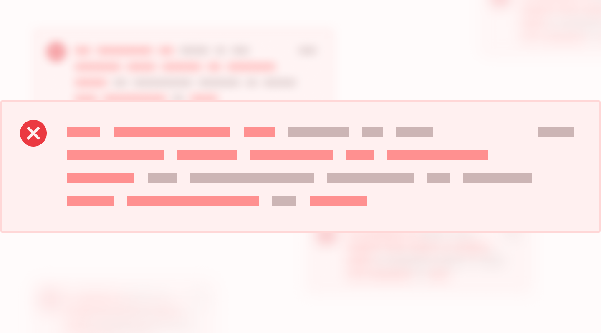
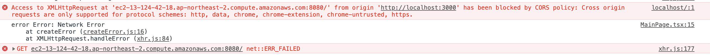
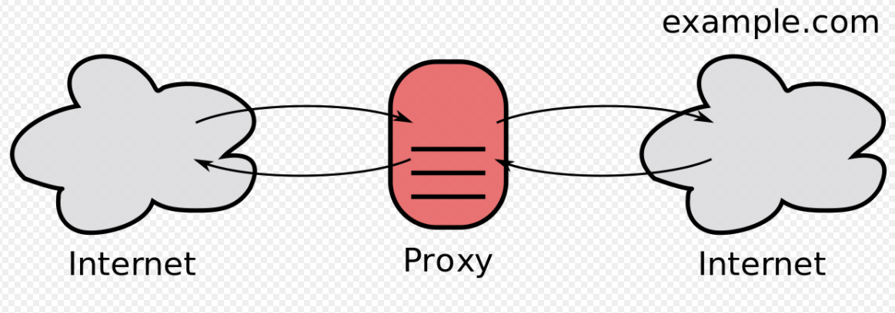

<br />
<br />
<div align="center">
    
</div>
<br />
<br />

# 🔎 사건의 발단

현재 비뉴라는 팀에서 프론트엔드 개발 파트를 맡아 바쁘게 프로젝트를 진행하고 있다.

필자는 프론트 개발을 하기 때문에 당시 로컬 환경에서 클라이언트 애플리케이션을 만들고 있었고, 마침 백엔드 개발자분이 미리 만들어서 배포한 개발 환경 API 서버와 통신을 시도해서 데이터를 확인하는 작업을 진행 중이었다.

<br />

## 하지만...

<br />

<br />
<div align="center" style="height: 80px;">
    
</div>
<br />

이렇게 오류 메시지만 뜨고 연결되지 않았다... 😂

처음 보는 오류였기 때문에 이 오류에 대해서 찾아보게 되었고,

그래서 알게 된 사실은...

<br />

## 바로!

<br />

### 🔥 `CORS 크로스 도메인 이슈` 라는 사실을 알게 되었다.

<br />
<br />

# 그렇다면 여기서 말하는 CORS란 무엇인가?

`CORS` 는 Cross Origin Resource Sharing의 약자로 번역하면 **'교차 출처 리소스 공유'** 라는 뜻을 의미한다.

일단 브라우저에서는 기본적으로 API를 요청할 때 브라우저의 현재 주소와 API의 주소의 도메인이 일치해야만 데이터를 접근할 수 있게 되어 있다고 한다.

이 말은 즉, 도메인 및 포트가 다른 서버로 클라이언트가 요청했을 때 브라우저가 보안상의 이유로 요청을 차단하는 이슈이다.

대표적인 예시로 클라이언트 쪽 개발 환경에서는 localhost:3000 포트에서 동작하는데, 서버 측의 포트가 localhost:8080라면 서버를 호출할 때 보안상의 이유로 오류가 발생하게 된다.

<br />
<br />
<br />

# 🚀 해결 방법

## 1. package.json를 통한 proxy 설정

<br />
<div align="center">
    
</div>
<br />

클라이언트 쪽에선 웹 팩 개발서버가 제공하는 `Proxy` 라는 기능이 있다.

웹 팩 개발서버의 프록시를 사용하게 되면, 브라우저 API를 요청할 때 백엔드 서버에 직접적으로 요청을 하지 않고, 현재 개발서버의 주소로 요청을 하게 된다.

그러면 웹 팩 개발 서버에서 해당 요청을 받아 그대로 백엔드 서버로 전달하고, 백엔드 서버에서 응답한 내용을 다시 브라우저 쪽으로 반환하게 된다.

웹 팩 개발서버의 proxy 설정은 원래 웹 팩 설정을 통해서 적용을 하지만, CRA를 통해 만든 리액트 프로젝트에서는 package.json에서 "proxy" 값을 설정하여 쉽게 적용할 수 있다.

`package.json` 을 열어서 아래와 같이 "proxy" 값을 설정하면 된다.

```jsx
{
  (...)
	"scripts": {
    "start": "react-scripts start",
    "build": "react-scripts build",
    "test": "react-scripts test",
    "eject": "react-scripts eject"
  },
	"proxy" : "http : // localhost : 4000" ,
}
```

<br />
<br />
<br />

## 2. http-proxy-middleware setupProxy.js를 통한 설정

먼저 `http-proxy-middleware` 를 npm 또는 Yarn을 사용해서 설치해준다.

```bash
$ npm install http-proxy-middleware --save
$ # or
$ yarn add http-proxy-middleware
```

다음으로 `src/setupProxy.js` 파일을 생성하여 다음과 같이 적는다.

```jsx
const { createProxyMiddleware } = require("http-proxy-middleware");

module.exports = function (app) {
  app.use(
    "/api",
    createProxyMiddleware({
      target: "http://localhost:8080", // 클라이언트와 포트가 다른 API 설정
      changeOrigin: true,
    })
  );
};
```

필자는 이 방법으로 해결했다. 👍🏻

<br />
<br />
<br />

# 👊🏻 자 이제 CROS 멈춰!

<br />
<div align="center" style="width: 100%;">
    
</div>
<br />
<br />

## ✔️ 참고

[CORS 크로스 도메인 이슈](https://wlsdud2194.github.io/posts/CORS-%ED%81%AC%EB%A1%9C%EC%8A%A4-%EB%8F%84%EB%A9%94%EC%9D%B8-%EC%9D%B4%EC%8A%88/)

[React - How To Proxy To Backend Server](https://medium.com/bb-tutorials-and-thoughts/react-how-to-proxy-to-backend-server-5588a9e0347)
